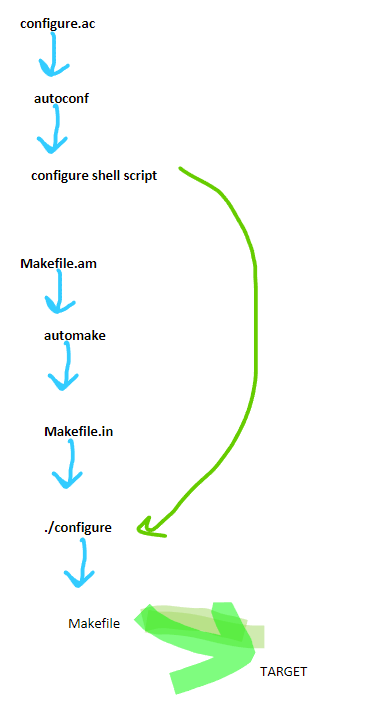
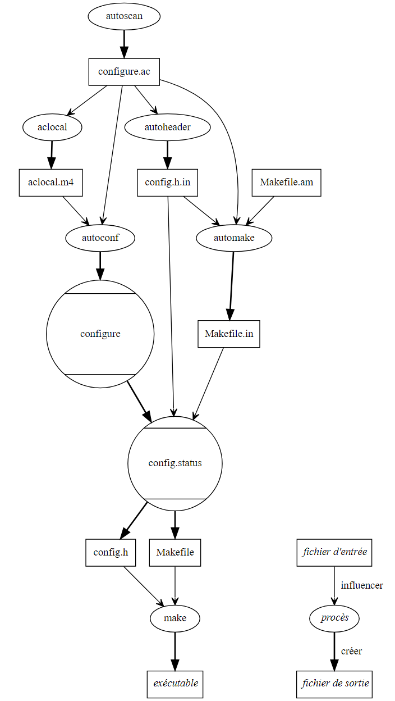

# Autotools

## Simplified flow

## Full pipeline

`configure.ac` and `Makefile.am` are the input files. `autoconf` turns `configure.ac`
into the `configure` shell script; `automake` turns `Makefile.am` into `Makefile.in`.
Running `./configure` then produces the final `Makefile`, which `make` uses to build the
target.

[Back to Build Flow](./)
