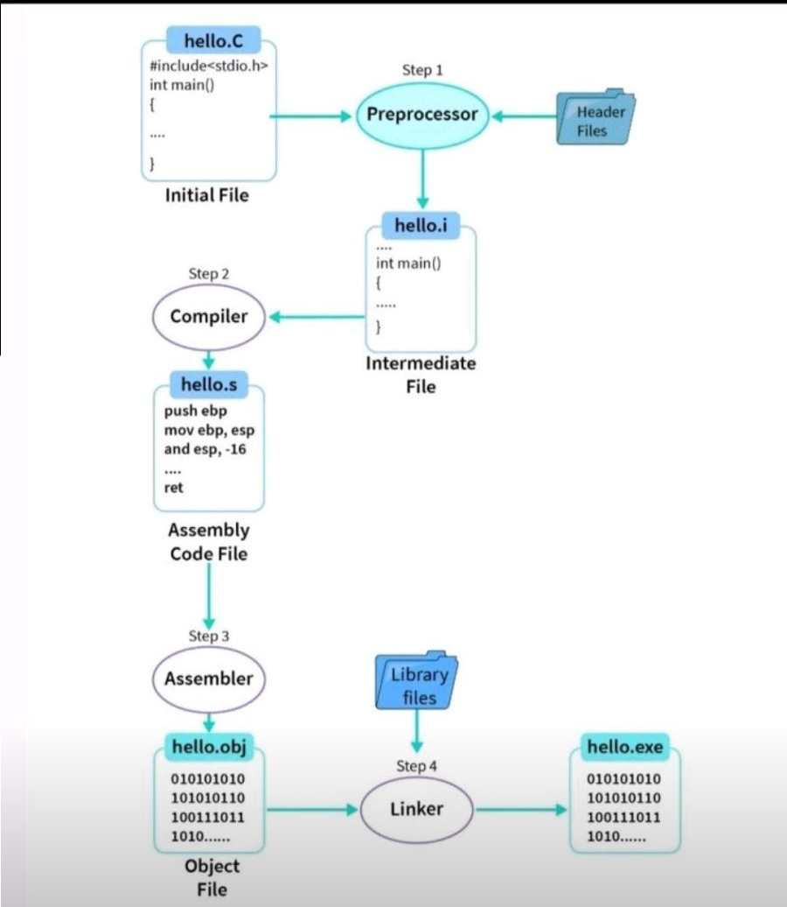
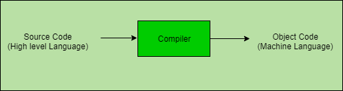
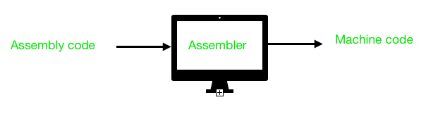

# Toolchain

- [Compilation process overview](#compilation-process-overview)
- [GCC](#gcc)
- [Binutils](#binutils)
- [gcov](#gcov)
- [GDB](#gdb)
- [ENV Script](#env-activation-helper-scripts)

---

## Compilation process overview



`hello.c` → **preprocessor** (expands headers) → `hello.i` → **compiler** → `hello.s`
(assembly) → **assembler** → `hello.obj` → **linker** (pulls in library files) →
`hello.exe`.

**Compile only (to assembly):**

```bash
gcc -S -o hello.s hello.c
cat hello.s
```

**Compile + assemble (to object file):**

```bash
gcc -c -Wall hello.c -o hello.o
objdump -D hello.o
```

**Everything (to executable):**

```bash
gcc -Wall hello.c -lm -o hello
./hello
readelf -a hello
```

---

## GCC



**`arm-none-eabi-gcc`** — GCC for ARM, no OS (`none`), embedded ABI (`EABI`). See
[this Stack Overflow answer](https://stackoverflow.com/questions/5961701/arm-gcc-toolchain-as-arm-elf-or-arm-none-eabi-what-is-the-difference)
for the naming convention.

**Extract the toolchain in the home directory:**

```bash
export PATH=$PATH:$HOME/arm-none-eabi-version-blabla/bin
```

**Simple example:**

```bash
gcc -c -Wall main.c -o main.o
```

**From A to Z (down to the executable):**

```bash
gcc -Wall main.c -o main -nostdlib
```

**With debug info:**

```bash
gcc -g …
```

**Compiler only:**

```bash
gcc -S -o hello.s hello.c
```

---

## Binutils



- **GNU Assembler** — processes assembly source into an object file.
- **GNU Linker** — processes the object file into machine binary language, driven by a
  linker script (`*.ld`).

**Simple example (continued):**

```bash
nm main.o
objdump -dSs main.o > main.dis
ld --oformat=elf64-x86-64 -o main -M --cref -Tscript.ld main.o > main.map  # creates the ELF and the .map
size -t main.o   # size of .data, .bss, .text
readelf main -a
```

---

## gcov

**Prerequisites:**

```makefile
CFLAGS = -fprofile-arcs -ftest-coverage
LFLAGS = -lgcov --coverage
```

```bash
gcov -b app.c            # run after a run/debug session
gcovr --html-details coverage.html   # run after gcov
```

---

## GDB

```bash
gdb ./my_app
```

| Command | Meaning |
|---|---|
| `list` | give line numbers |
| `break 20` | stop at line 20 |
| `run` (F8) | start the program |
| `next` (F6) | step over |
| `step` (F5) | step into |
| `print toto` | display a variable |
| `c` | resume |

**Cool stuff:**

```gdb
layout src     ; source view — great
layout asm     ; show disassembly
info register r0
layout regs
```

## env activation helper scripts
1. baremetal source script
```bash
#!/bin/bash

# Check if the project directory is provided
if [ -z "$1" ]; then
  echo "Usage: source baremetal_env_activate.sh <project_directory>"
  return 1
fi

# Add arm-none-eabi bin folder to the PATH
export PATH="$HOME/code_heap/arm-gnu-toolchain-15.2.rel1-x86_64-arm-none-eabi/bin:$PATH"

# Change to the specified project directory
cd "$1"

# Optional: Print a message to confirm the environment is set up
echo "Environment set up for project: $1"
```
2. arm source script
```bash
#!/bin/bash

# Check if the project directory is provided
if [ -z "$1" ]; then
  echo "Usage: source linux_arm_env_activate.sh <project_directory>"
  return 1
fi

# Add aarch64-none-linux bin folder to the PATH
PATH="$HOME/code_heap/arm-gnu-toolchain-15.3.rel1-x86_64-arm-none-linux-gnueabihf/bin:$PATH"
ARCH=arm
CROSS_COMPILE=arm-none-linux-gnueabihf-

# Change to the specified project directory
cd "$1"
# Expose variables
export PATH ARCH CROSS_COMPILE

echo "Environment set up for project: $1"
```
3. aarch64 source script
```bash
#!/bin/bash

# Check if the project directory is provided
if [ -z "$1" ]; then
  echo "Usage: source linux_env_activate.sh <project_directory>"
  return 1
fi

# Add aarch64-none-linux bin folder to the PATH
PATH="$HOME/code_heap/arm-gnu-toolchain-15.2.rel1-x86_64-aarch64-none-linux-gnu/bin:$PATH"
ARCH=arm64
CROSS_COMPILE=aarch64-none-linux-gnu-

# Change to the specified project directory
cd "$1"
# Expose variables
export PATH ARCH CROSS_COMPILE

echo "Environment set up for project: $1"
```

[Back to Build Flow](./)
