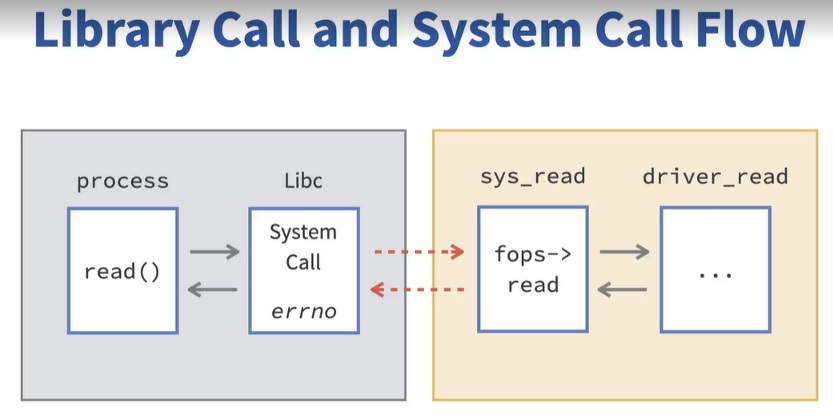

# Kernel Drivers

- [Linux Kernel Overview](#linux-kernel-overview)
- [Kernel Drivers](#kernel-drivers)
- [User Space Drivers](#user-space-drivers)
- [Appendix: Cross-Compilation & Patch Submission Workflow](#appendix-cross-compilation--patch-submission-workflow)

---

## Linux Kernel Overview

- System calls: implemented in the kernel, called from user space.



- Virtual FS: `/proc` & `sysfs`
  - `/proc/meminfo`: amount of RAM.
  - `/sys` (sysfs)
    - Tree structure to see the HW and buses connected to the kernel.
    - Modules (statically or dynamically loaded): `/sys/modules`.
    - Inside `/sys/modules` are the parameters to pass when invoking `insmod`.
- `dmesg`: kernel RAM buffer.
- `bzImage`: x86 kernel image.
- `make all`: `bzImage` + modules.
- `make modules`: only `.ko` modules.
- `make modules_install`: installs into `/lib/modules`.
- Searching in the kernel:
  - `make cscope` then `cscope -d`
  - `git grep`
  - `find . -name "*.c" -exec grep TOTO`
  - `make tags` (keybindings in nvim)
- Network:
  - `ip addr`
  - `sudo ethtool enpxxx` / `sudo ethtool -i enpxxx` — for the corresponding driver.

## Kernel Drivers

- Device files: `/dev`
  - Character device driver
    - File operations struct (`read` / `write` overloaded) initializes the proper
      functions for API calls.
    - Allocate with minor and major numbers in `/dev`: `sudo mknod mychar c 168 1`.
    - `write` → **copy_from_user**. `read` → **copy_to_user**.
  - Block device driver
- LKM (`.ko`):
  - `/lib/modules`
  - `lsmod` (list of dynamically loaded modules) / `modprobe` (loads dependencies
    as well!) / `insmod` / `rmmod`.
  - Compile the module with the `linux-headers` matching the distro in use.
- Using an LKM after editing the source:
  - `make modules` … `make modules_install` … `rmmod` (remove the current one) …
    `insmod` (insert the new one).
- Inserting a static module in the kernel:
  - `make bzImage` … `make install` … reboot.
- `printk` output ends up in the kernel's RAM buffer (`dmesg` to see it).
- debugfs: `/sys/kernel/debug`
- Tracing: `/sys/kernel/debug/tracing`
- `bpftrace -e` to trace calls:

  ```bash
  sudo bpftrace -e 'kprobe:toto_module{printf("function called by %s (PID=%d")\n", comm, pid;}'
  ```

## User Space Drivers

- More scalable, more flexible, more languages (Python).
- Use cases: GPIO, sensors (⚠️ not for low-latency things — switch to kernel space
  for a faster response).

---

## Appendix: Cross-Compilation & Patch Submission Workflow

> Recommended dev environment: **Linux** (native, VM, or WSL2 under Windows).
> Kernel dev + `git send-email` is much smoother on Linux. The commands below
> assume a **Debian/Ubuntu** base.

### 1. Install the AArch64 cross-compilation toolchain

```bash
sudo apt update
sudo apt install -y \
    gcc-aarch64-linux-gnu \
    g++-aarch64-linux-gnu \
    binutils-aarch64-linux-gnu \
    build-essential \
    bc bison flex libssl-dev libncurses-dev \
    git make
```

Check:

```bash
aarch64-linux-gnu-gcc --version
```

### 2. Fetch the kernel sources

For upstream (mainline) dev:

```bash
git clone https://git.kernel.org/pub/scm/linux/kernel/git/torvalds/linux.git
cd linux
```

To actually test/boot on an RPi 3B+ (RPi fork):

```bash
git clone --depth=1 https://github.com/raspberrypi/linux.git rpi-linux
```

### 3. Configure and build for AArch64

Set the cross-compilation environment variables:

```bash
export ARCH=arm64
export CROSS_COMPILE=aarch64-linux-gnu-
```

Generate a default config, then build:

```bash
# Generic arm64 config (mainline)
make defconfig

# For the RPi 3B+ on the raspberrypi/linux fork, use instead:
# make bcm2711_defconfig      # RPi 3B+ boots with the 64-bit bcm2711 kernel

# Build (adjust -j to the number of cores)
make -j"$(nproc)" Image modules dtbs
```

Produces:

- `arch/arm64/boot/Image` — the kernel.
- `arch/arm64/boot/dts/broadcom/*.dtb` — the device trees.
- `.ko` modules.

### 4. Deploy on the RPi 3B+ (real test)

Mount the SD card (`boot` + `rootfs` partitions), then:

```bash
# Kernel
sudo cp arch/arm64/boot/Image /media/$USER/boot/kernel8.img

# Device tree
sudo cp arch/arm64/boot/dts/broadcom/bcm2837-rpi-3-b-plus.dtb /media/$USER/boot/

# Modules
sudo make ARCH=arm64 CROSS_COMPILE=aarch64-linux-gnu- \
    INSTALL_MOD_PATH=/media/$USER/rootfs modules_install
```

Make sure `config.txt` contains `arm_64bit=1`. Eject cleanly, boot, check
`uname -a`.

### 5. Cross-compile an out-of-tree module (your driver)

Minimal module `Makefile`:

```makefile
obj-m += mydriver.o

KDIR ?= /path/to/linux   # kernel tree built above

all:
	$(MAKE) -C $(KDIR) M=$(PWD) \
	    ARCH=arm64 CROSS_COMPILE=aarch64-linux-gnu- modules

clean:
	$(MAKE) -C $(KDIR) M=$(PWD) \
	    ARCH=arm64 CROSS_COMPILE=aarch64-linux-gnu- clean
```

Build: `make` → produces `mydriver.ko`. Copy it to the target, `insmod mydriver.ko`,
check `dmesg`.

---

### 6. Configure `git send-email`

#### 6.1 Install the tool

```bash
sudo apt install -y git-email
```

#### 6.2 Git identity (the name/email will appear in the `Signed-off-by`)

```bash
git config --global user.name "First Last"
git config --global user.email "first.last@example.com"
```

> Use a **stable, real** address: it will be public forever in the kernel history.

#### 6.3 Configure the SMTP server

Generic example (adapt to your provider):

```bash
git config --global sendemail.smtpServer "smtp.example.com"
git config --global sendemail.smtpServerPort 587
git config --global sendemail.smtpEncryption tls
git config --global sendemail.smtpUser "first.last@example.com"
```

Example with Gmail (requires an **app password**, NOT the account password):

```bash
git config --global sendemail.smtpServer "smtp.gmail.com"
git config --global sendemail.smtpServerPort 587
git config --global sendemail.smtpEncryption tls
git config --global sendemail.smtpUser "your.address@gmail.com"
```

> ⚠️ Never store the SMTP password in clear text in the config. Let
> `git send-email` prompt for it interactively, or use a credential helper
> (`git-credential`). For Gmail: enable 2FA then generate a dedicated "App
> Password".

#### 6.4 Recommended settings for the kernel

```bash
# Don't silently add surprise Cc recipients
git config --global sendemail.confirm always

# Consistent signature/format
git config --global format.signoff true
```

---

### 7. Prepare and send a patch series

#### 7.1 Create the patches

After committing (with `git commit -s` to add the `Signed-off-by`):

```bash
# Single patch
git format-patch -1

# Series of N patches with a cover letter
git format-patch -o outgoing/ --cover-letter origin/master..HEAD
```

Edit `outgoing/0000-cover-letter.patch` to describe the series.

#### 7.2 Check BEFORE sending (mandatory)

```bash
# Kernel style compliance
scripts/checkpatch.pl --strict outgoing/*.patch

# Identify the right recipients (maintainers + lists)
scripts/get_maintainer.pl outgoing/0001-*.patch
```

#### 7.3 Send

```bash
git send-email \
    --to="maintainer@example.org" \
    --cc="linux-iio@vger.kernel.org" \
    --cc="linux-kernel@vger.kernel.org" \
    outgoing/*.patch
```

> Tip: `git send-email` can read recipients automatically if you pass patches
> generated with the right headers. Always double-check the proposed list before
> confirming the send.

#### 7.4 Modern alternative: `b4`

```bash
sudo apt install -y b4     # or: pip install b4
```

`b4` simplifies sending series, versioning (`v2`, `v3`), and tracking reviews.
Recommended as soon as you manage multi-patch series.

---

### 8. Checklist before any first submission

- [ ] `git commit -s` (`Signed-off-by` present).
- [ ] `scripts/checkpatch.pl --strict` with no errors.
- [ ] `scripts/get_maintainer.pl` to target the right recipients.
- [ ] YAML bindings validated by `dt-schema` (if driver + DT).
- [ ] Patch **tested on real hardware** (RPi 3B+).
- [ ] Clear cover letter for a series (`--cover-letter`).
- [ ] Send first **to yourself** as a test (`--to=your.own.address`) to check the
  formatting before mailing the list.

---

### Appendix — Testing modified kernels under QEMU (x86_64 / arm / arm64)

> Goal: a fast **compile → boot → shell** test loop without real hardware, to
> validate a patch before submission. QEMU covers **compile + boot + module
> loading + subsystem core**. The "tested on real hardware" validation (required
> by maintainers) still happens on the **RPi 3B+** (phase 2).
>
> Two ready-to-use scripts can back this workflow: a `build-initramfs.sh` script
> that generates a minimal BusyBox rootfs, and a `qrun.sh` script that boots the
> kernel with the right QEMU invocation.

#### A.1 Common principle

Booting a kernel in QEMU needs **3 ingredients**:

1. **The compiled kernel** (`bzImage` on x86, `zImage` on arm, `Image` on arm64).
2. **A rootfs** — simplest option: a **BusyBox initramfs** (drops straight into a
   shell).
3. **The right QEMU invocation** (machine, CPU, console).

⚠️ Pitfall #1: the **console serial port name changes per architecture** —
`ttyS0` on x86, `ttyAMA0` on ARM/ARM64 with the `virt` machine. This is the cause
of 90% of "it boots but no shell" issues.

⚠️ Pitfall #2: BusyBox is compiled **statically** → one rootfs per architecture
(binaries aren't portable across architectures).

QEMU packages (Debian/Ubuntu):

```bash
sudo apt install -y qemu-system-x86 qemu-system-arm
```

#### A.2 Generate the rootfs (once per architecture)

```bash
cd kernel_dev
./build-initramfs.sh x86      # -> rootfs-x86.cpio.gz
./build-initramfs.sh arm      # -> rootfs-arm.cpio.gz
./build-initramfs.sh arm64    # -> rootfs-arm64.cpio.gz
```

Copy (or link) the desired `rootfs-<arch>.cpio.gz` into the kernel source root,
or point to it via the `ROOTFS` variable (see A.4).

#### A.3 Quick boot (from the kernel source root)

```bash
# rootfs-<arch>.cpio.gz present in the current directory
/path/to/kernel_dev/qrun.sh x86
/path/to/kernel_dev/qrun.sh arm
/path/to/kernel_dev/qrun.sh arm64
```

Typical dev loop:

```bash
make -j"$(nproc)" Image && /path/to/kernel_dev/qrun.sh arm64
```

Quit QEMU in `-nographic` mode: `Ctrl-a` then `x`.

#### A.4 QEMU invocation details (what `qrun.sh` does)

**x86_64 → `qemu-system-x86_64`**

```bash
qemu-system-x86_64 \
  -M q35 \
  -kernel arch/x86/boot/bzImage \
  -initrd rootfs-x86.cpio.gz \
  -append "console=ttyS0" \
  -nographic -m 512
```

Add **`-enable-kvm -cpu host`** if the host is x86_64 → near-instant boot (pass it
via `EXTRA="-enable-kvm -cpu host"`).

**ARM 32-bit → `qemu-system-arm`**

```bash
qemu-system-arm \
  -M virt -cpu cortex-a15 \
  -kernel arch/arm/boot/zImage \
  -initrd rootfs-arm.cpio.gz \
  -append "console=ttyAMA0" \
  -nographic -m 512
```

Build with **`multi_v7_defconfig`** (includes PL011 + virtio). The `virt` machine
generates its device tree automatically (no need for `-dtb`).

**ARM64 → `qemu-system-aarch64`**

```bash
qemu-system-aarch64 \
  -M virt -cpu cortex-a53 \
  -kernel arch/arm64/boot/Image \
  -initrd rootfs-arm64.cpio.gz \
  -append "console=ttyAMA0" \
  -nographic -m 512
```

`cortex-a53` = exactly the RPi 3B+ core → consistent with phase 2. The arm64
`defconfig` already includes everything needed.

#### A.5 Kernel config required per architecture

| Arch | Key symbols | Recommended defconfig |
|---|---|---|
| x86_64 | `CONFIG_SERIAL_8250_CONSOLE`, `CONFIG_BLK_DEV_INITRD` | `x86_64_defconfig` |
| ARM 32 | `CONFIG_SERIAL_AMBA_PL011[_CONSOLE]`, `CONFIG_ARCH_VIRT` | `multi_v7_defconfig` |
| ARM64 | `CONFIG_SERIAL_AMBA_PL011[_CONSOLE]`, virtio | `defconfig` |

#### A.6 Bonus — network + disk (testing a real driver / virtio device)

```bash
# User-mode network + SSH forward (host:2222 -> guest:22)
-netdev user,id=n0,hostfwd=tcp::2222-:22 -device virtio-net-device,netdev=n0
# Virtio disk
-drive file=disk.img,if=none,id=d0,format=raw -device virtio-blk-device,drive=d0
```

> On the `virt` machine (ARM/ARM64): use the **`virtio-*-device`** variants (MMIO
> bus). On x86 `q35`: use the **`virtio-*-pci`** variants.

Pass these via `EXTRA="..."` to `qrun.sh`.

#### A.7 Bonus — GDB debugging the kernel in QEMU

```bash
# Terminal 1: QEMU paused, GDB server on :1234
EXTRA="-s -S" ./qrun.sh arm64

# Terminal 2: from the kernel source root
gdb-multiarch vmlinux
(gdb) target remote :1234
(gdb) hbreak start_kernel
(gdb) continue
```

Very useful for instrumenting a patch before submission.

#### A.8 Recap — the cheat sheet at a glance

| Arch | QEMU binary | `-M` / `-cpu` | Kernel image | Console |
|---|---|---|---|---|
| x86_64 | `qemu-system-x86_64` | `q35` (+`-enable-kvm`) | `arch/x86/boot/bzImage` | `ttyS0` |
| ARM 32 | `qemu-system-arm` | `virt` / `cortex-a15` | `arch/arm/boot/zImage` | `ttyAMA0` |
| ARM64 | `qemu-system-aarch64` | `virt` / `cortex-a53` | `arch/arm64/boot/Image` | `ttyAMA0` |

> ⚠️ Reminder: QEMU's `virt` machine does **not** emulate your real I2C/SPI
> sensor. QEMU = fast loop (compile/boot/module); RPi 3B+ = final "tested on real
> hardware" validation.

[Back to Embedded Linux](./)
