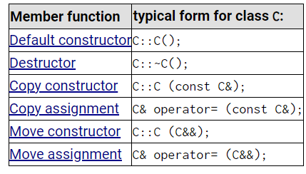
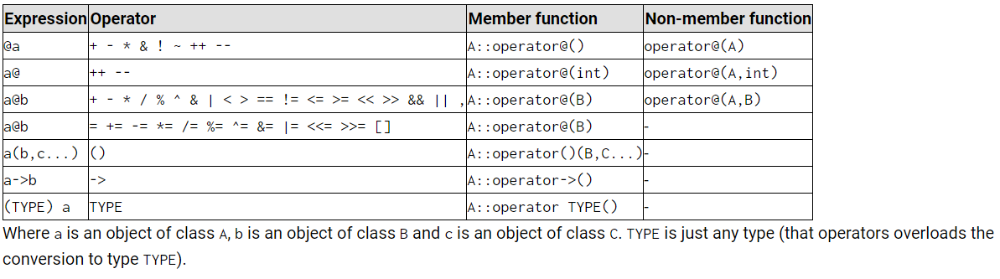
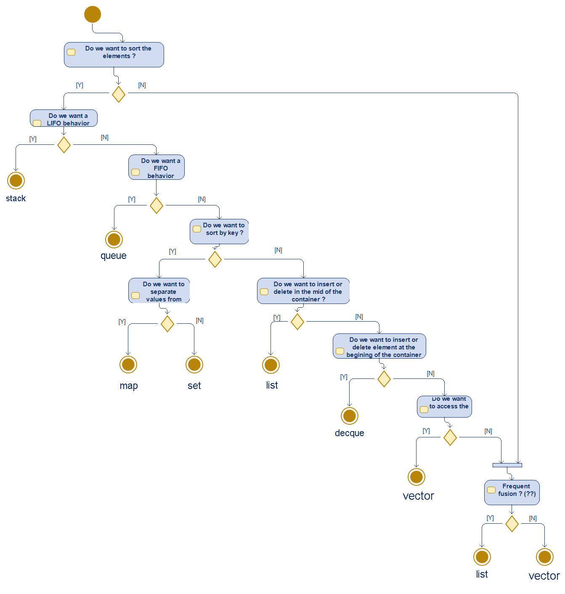
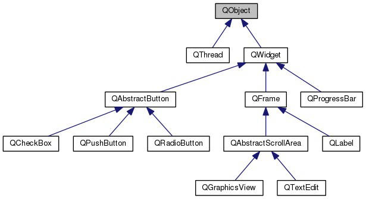

# C++

- [General](#general)
- [Class basics](#class-basics)
- [Copy constructor vs assignment operator](#copy-constructor-vs-assignment-operator)
- [Inheritance & polymorphism](#inheritance--polymorphism)
- [Smart pointers](#smart-pointers)
- [Special member functions](#special-member-functions)
- [Operator overloading](#operator-overloading)
- [STL](#stl)
- [Container wizard](#container-wizard)
- [Google guidelines](#google-guidelines)
- [Qt](#qt)
- [Qt Designer (WYSIWYG)](#qt-designer-wysiwyg)
- [SQL database with Qt](#sql-database-with-qt)
- [Project ideas](#project-ideas)

---

## General

```cpp
std::cout << "Hello\n";      // preferred

std::string str = "Coucou";
for (auto ch : str)          // equivalent of Python's `for ch in str`

int n(0);                    // variable initialization

std::vector<int> toto(5, 0); // vector of 5 ints initialized to 0
```

---

## Class basics

**Header:**

- Methods go in `public`: prototypes, constructor, **virtual** destructor.
- Attributes go in `protected` — *protected = private, except for derived classes*.
- Prefix members with `m_`.

**Source file:**

- Use an initialization list in the constructor: `: m_toto(0), m_tata(tata)`.
- **Comparison** operator overloads live in the class file but are **not** members of
  the class.
- **Arithmetic** operator overloads **are** class members.

**Best practice to instantiate objects inside objects: the pointer.**

```cpp
Arme *m_arme;

m_arme = new Arme();   // in the constructor
delete m_arme;         // in the destructor
```

Static functions have no access to the attributes of instantiated objects
(e.g. an object counter).

---

## Copy constructor vs assignment operator

> **Careful with the copy constructor:** if the object holds a pointer, the copy will
> point at the very same sub-object.

```cpp
Personnage::Personnage(Personnage const& personnageACopier)
  : m_vie(personnageACopier.m_vie), m_mana(personnageACopier.m_mana), m_arme(0)
{
    m_arme = new Arme(*(personnageACopier.m_arme));
}
```

Doing this copies every attribute except the pointer — a fresh one is built from
`Arme`'s constructor.

**Not to be confused with the assignment operator:**

```cpp
Personnage& Personnage::operator=(Personnage const& personnageACopier)
{
    if (this != &personnageACopier)   // check it is not the same object
    {
        m_vie  = personnageACopier.m_vie;   // copy every field
        m_mana = personnageACopier.m_mana;
        delete m_arme;
        m_arme = new Arme(*(personnageACopier.m_arme));
    }
    return *this;                      // return the object itself
}
```

---

## Inheritance & polymorphism

```cpp
class Mere : public Fille {
};
```

**Polymorphism:**

```cpp
virtual void affiche() const;
```

Assuming the virtual method above also exists with the same name in the children of
the `Vehicule` class, the function actually called depends on the parameter passed by
reference.

**Pure virtual method:**

```cpp
virtual int nbrRoues() const = 0;   // number of wheels of the vehicle
```

Not implemented in the base class — which therefore becomes an abstract class and
cannot be instantiated.

**Using pointers to objects in a vector:**

```cpp
std::vector<Figure*> my_figures;

my_figures.push_back(new Triangle(4, 5));
my_figures.push_back(new Carre(10));
my_figures.push_back(new Rectangle(3, 5));
my_figures.push_back(new Cercle(9));

// Clean
for (unsigned int i(0); i < my_figures.size(); i++)
{
    delete my_figures[i];
    my_figures[i] = 0;
}
```

---

## Smart pointers

- **`unique_ptr`** — recommended in C++: no `delete`/`free` needed.
- **`shared_ptr`** — same, plus it lets you hand ownership over to a function without
  having to `return` a pointer to the object.

---

## Special member functions



| Member function | Typical form for class `C` |
|---|---|
| Default constructor | `C::C();` |
| Destructor | `C::~C();` |
| Copy constructor | `C::C(const C&);` |
| Copy assignment | `C& operator= (const C&);` |
| Move constructor | `C::C(C&&);` |
| Move assignment | `C& operator= (C&&);` |

---

## Operator overloading



---

## STL

### Common methods

`empty()` · `size()` · `clear()` · `swap()`

### Per-container methods

| Container | Methods |
|---|---|
| `vector` | `push_back()`, `pop_back()`, `insert(myVector.begin())` |
| `deque` | `push_front()`, `pop_front()`, `push_back()`, `pop_back()` |
| `stack` | `push()`, `pop()`, `top()` (accessor) |
| `queue` (FIFO) | `push()`, `pop()`, `front()` (accessor) |

Reference: [cplusplus.com/reference/](https://cplusplus.com/reference/)

### C legacy headers

| C | C++ |
|---|---|
| `math.h` | `<cmath>` |
| `stdlib.h` | `<cstdlib>` (`rand()`) |
| `assert.h` | `<cassert>` |

`<cctype>`: `isalpha()`, `isdigit()`, `islower()`, `isupper()`, `isspace()`

`<ctime>`: `time(0)` — Unix time

### Map example (key/value pairs)

```cpp
#include <map>
#include <string>
#include <fstream>
#include <iostream>
using namespace std;

int main()
{
    ifstream fichier("texte.txt");
    string mot;
    map<string, int> occurrences;

    while (fichier >> mot)      // read the file word by word
    {
        ++occurrences[mot];     // increment the counter of the word read
    }
    cout << "Le mot 'banane' existe " << occurrences["banane"]
         << " fois dans le fichier" << endl;
    return 0;
}
```

### Iterator

```cpp
#include <deque>
#include <iostream>
using namespace std;

int main()
{
    deque<int> d(5, 6);        // a deque of 5 elements holding 6
    deque<int>::iterator it;   // an iterator on a deque of ints

    // and we iterate over the deque
    for (it = d.begin(); it != d.end(); ++it)
    {
        cout << *it << endl;   // dereference with the star to reach the element
    }
    return 0;
}
```

### Searching an element in a map

```cpp
map<string, double> poids;

poids["souris"]   = 0.05;
poids["tigre"]    = 200;
poids["chat"]     = 3;
poids["elephant"] = 10000;

map<string, double>::iterator trouve = poids.find("chien");
```

`it->first` gives the key, `it->second` gives the value.

---

## Container wizard

Decision tree to pick the right STL container.



---

## Google guidelines

Source: Low Level Learning.

1. **Tabs** — use 4 spaces.
2. **Don't overuse `auto`** — `for (auto …)` is fine.
3. **Ownership**
   - The owner is the object responsible for a pointer transfer.
   - Whoever `malloc`s is whoever `free`s.
   - If another part of the code needs the object, use smart pointers:
     - Single owner: `std::unique_ptr<Toto> toto = std::make_unique<Toto>();`
     - Pointer passed to a function: `std::shared_ptr<Toto> toto = std::make_shared<Toto>();`
       with `void fct(std::shared_ptr<Toto> t)`
4. **Do not use exceptions** (try/catch).
5. **Inheritance**
   - Avoid multiple inheritance.
   - Prefer inheriting from an abstract (virtual) class.
   - Or use composition — embed the object inside the class.

---

## Qt

### Qt Creator

- Compiler: MinGW64
- Build flow: CMake

Three application types:

- Qt command line
- Qt Widget (desktop)
- Qt Quick (QML)



### Tutorials followed

1. [Basic Qt Programming Tutorial — Qt Wiki](https://wiki.qt.io/Basic_Qt_Programming_Tutorial) — **done**
   - New project
   - Choose the build system and the toolchain
   - Qt GUI mode
   - Choose the base class (Widget for instance, otherwise Window)
   - Build the UI
   - Add the member functions, getters, setters…
2. 2h30 YouTube tutorial — **done**
   - Create the `QApplication` object
   - Start the event loop (`a.exec()`)
   - The child is destroyed when the parent is deleted → safe
   - `connect(ui->pushButton_insertData, SIGNAL(clicked()), this, SLOT(insert_data()));`
   - `Q_OBJECT` macro — parses the classes and mocks them
   - `QList<CustomButton*>` → a list of button pointers
   - `F4` = switch between `.h` and `.cpp`
   - `Alt + Enter` = create the implementation from the function prototype
   - Signals / slots — signal = `clicked()`, slot = the event callback
   - `QString("Bouton de gauche %1").arg(i)`
   - Basics on QWidgets
3. Claire Schmidt YouTube tutorial (converter) — **done**
   - For `connect`, prefer the `SIGNAL` / `SLOT` form
   - New file for a new class, or create a new UI based on a class
     (Qt Designer *from class*, e.g. for non-main windows)
4. [Qt for Beginners — Qt Wiki](https://wiki.qt.io/Qt_for_Beginners) — **done**

---

## Qt Designer (WYSIWYG)

Building the UI by hand is interesting because you only declare and define what you
need — but it is long and time consuming.

The compromise found:

- Use Qt Designer.
- Work **bottom-up**:
  - Drop the widgets roughly in place,
  - Organize them in a layout,
  - Drop more widgets alongside the previous layout,
  - Organize those in a higher level layout,
  - And so on.
- Then right-click a frame widget → **Layout → Define Layout as a Grid**.
- Finally right-click `MainWindow` → **Layout → Define Layout as a Grid**.

This keeps the widgets flexible when the window is resized.

> **Important:** there must be no **red panel** on a layout in the right-hand tab.

---

## SQL database with Qt

1. Tool to browse / create databases (`*.db` files): **SQLite Studio**
2. Suitable widgets: `QTableView`, `QTableWidget`
3. The four main queries to run against a database:

```sql
-- Insert
INSERT INTO Table_1(Column_1,Column_2,Column_3,Column_4)
VALUES(:Column_1,:Column_2,:Column_3,:Column_4);

-- Update
UPDATE Table_1 SET Column_2=:Column_2,Column_3=:Column_3,Column_4=:Column_4
WHERE Column_1=:Column_1;

-- Delete
DELETE FROM Table_1 WHERE Column_1=:Column_1;

-- Load
SELECT * FROM Table_1;
```

---

[Back to Languages](./)
