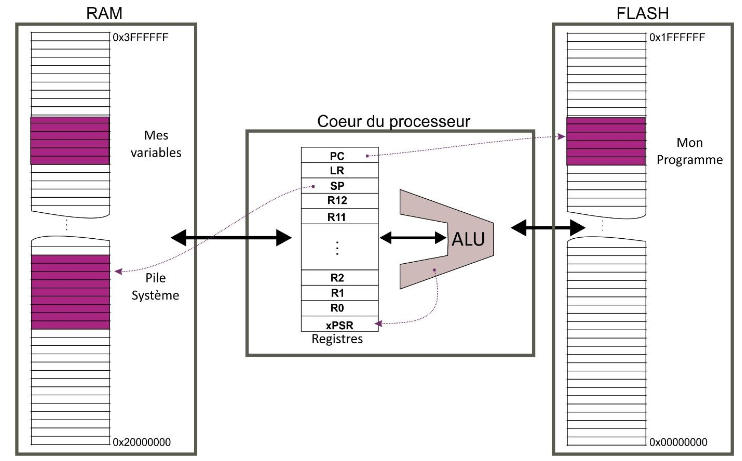
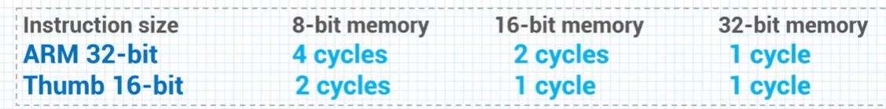
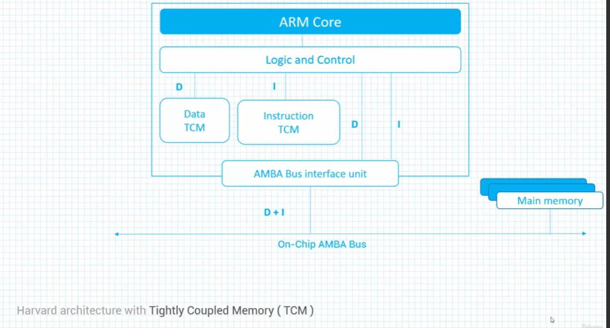
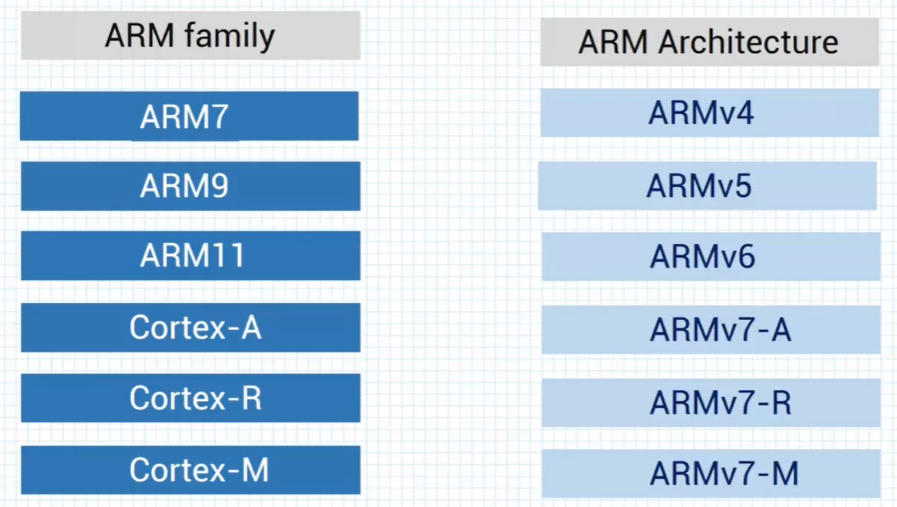

# ARM Architecture

The program lives in FLASH, variables and the system stack live in RAM. The core
holds the register bank (`R0`..`R12`, `SP`, `LR`, `PC`, `xPSR`) feeding the ALU.

## RISC design philosophy

- Reduced instruction set
- Pipeline (fetch, decode, execute)
- One cycle per instruction
- Complexity placed on the compiler

## Instruction size vs memory width

| Instruction size | 8-bit memory | 16-bit memory | 32-bit memory |
|---|---|---|---|
| ARM 32-bit | 4 cycles | 2 cycles | 1 cycle |
| Thumb 16-bit | 2 cycles | 1 cycle | 1 cycle |

A 32-bit core can address `2^32` bytes of memory.

## Harvard architecture with Tightly Coupled Memory (TCM)

Separate Data and Instruction TCM sit next to the core; the AMBA bus interface
unit merges D + I traffic towards main memory on the on-chip AMBA bus.

## Families and architectures

| ARM family | ARM architecture |
|---|---|
| ARM7 | ARMv4 |
| ARM9 | ARMv5 |
| ARM11 | ARMv6 |
| Cortex-A | ARMv7-A |
| Cortex-R | ARMv7-R |
| Cortex-M | ARMv7-M |

[Back to Software Architecture](./)
