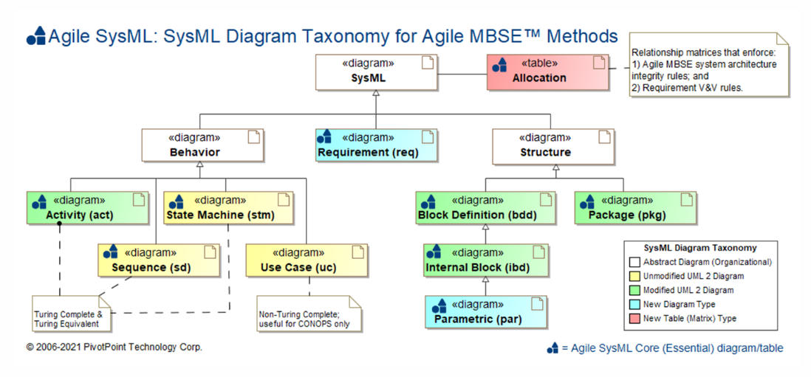

# SysML with Modelio

SysML standard — tailored to systems in general (not only software).

## The diagrams that matter most

- **Requirement Diagram** (`req`)
- **Use Case Diagram** (`uc`)
- **Activity Diagram** (`act`)
- **Block Definition Diagram** (`bdd`) — the Class Diagram equivalent
- **Internal Block Diagram** (`ibd`) — the Composite Structure Diagram equivalent
- **State Machine Diagram** (`stm`)
- **Sequence Diagram** (`sd`)

## Modelio workflow

1. Create a project.
2. In the explorer, right-click the project.
   - Diagram Wizard
   - Import the SysML module to get the proper diagram templates
   - Keep the *dev* perspective so that **Symbol → Properties** stays at hand

[Back to Software Architecture](./)
