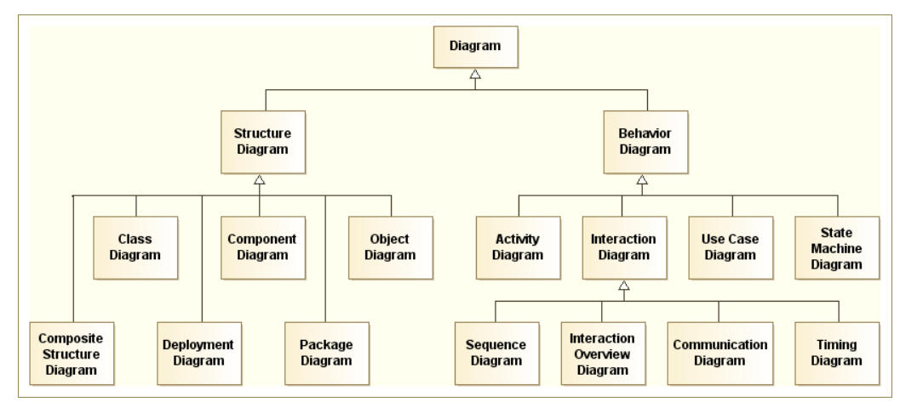
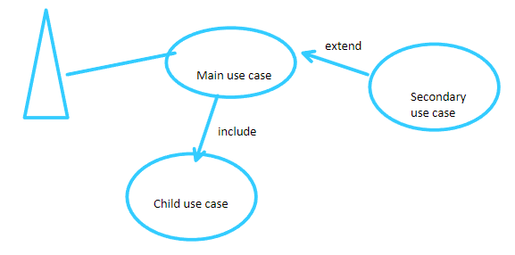

# UML with Modelio

UML standard — tailored to object oriented software.

## The diagrams that matter most

- **Use Case Diagram** — actors, use cases, include / extend
- **Activity Diagram** — algorithms
- **Class Diagram** — classes, attributes, methods, visibilities
- **Composite Structure Diagram** — internal structure of a class, ports
- **State Machine Diagram** — FSM
- **Sequence Diagram** — interaction sequence between actors

## Use case relationships

- **Include** — the source of the arrow *contains* the destination (what the arrow points at).
- **Extend** — the source of the arrow is required by the use case at the arrow tip
  **under a condition** (e.g. only if the actor is a salesperson).

## Class diagram relationships

- **Association** — e.g. a teacher has multiple students.
- **Aggregation** — a wheel is part of a car, but it can exist independently.
- **Composition** — stronger form: the part cannot exist without the whole.

## Modelio workflow

1. Create a project.
2. In the explorer, right-click the project.
   - Diagram Wizard
   - Choose the diagram
   - Keep the *dev* perspective so that **Symbol → Properties** stays at hand

[Back to Software Architecture](./)
